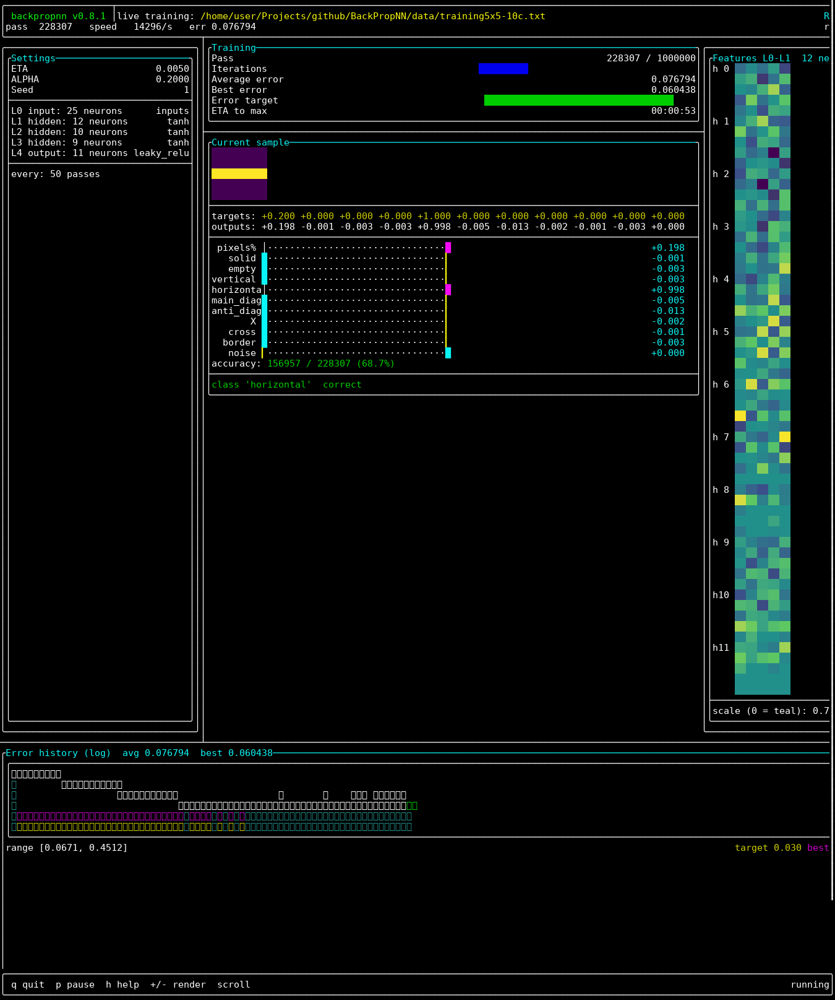

# BackPropNN — User Manual

**Application:** `backpropnn` **v0.8.1**

A back-propagation neural network trainer in Modern C++20 with an optional
live terminal dashboard (TUI).

---

## Table of contents

1. [Overview](#1-overview)
2. [Requirements](#2-requirements)
3. [Building](#3-building)
4. [Running the trainer](#4-running-the-trainer)
5. [Training file format](#5-training-file-format)
6. [Training defaults and stopping criteria](#6-training-defaults-and-stopping-criteria)
7. [Live training dashboard (TUI)](#7-live-training-dashboard-tui)
8. [Classic plain-text output](#8-classic-plain-text-output)
9. [Bundled datasets](#9-bundled-datasets)
10. [Troubleshooting](#10-troubleshooting)

---

## 1. Overview

BackPropNN trains a multi-layer feed-forward network with backpropagation on a
plain-text training script you provide. The same script format works for every
task — swap a file, no code changes needed.

Two output modes:

| Mode | When | Audience |
|------|------|----------|
| **Live TUI dashboard** | stdout is a real terminal | Interactive observation & control |
| **Classic plain text** | stdout is piped/redirected, or TUI disabled | Scripts, logs, CI |

## 2. Requirements

- C++20 compiler
- CMake **≥ 3.20** (for the CMake build)
- Network access on first CMake configure (FTXUI v5.0.0 is downloaded via
  `FetchContent`) — not needed with `-DBPNN_TUI=OFF` or the standalone Makefile
- POSIX terminal for the TUI (`isatty` detection; Linux/macOS/WSL)

## 3. Building

### 3.1 CMake (recommended, includes TUI)

```bash
cd build
cmake ..
make -j
```

- The executable is written to **`bin/backpropnn`**.
- FTXUI is fetched automatically and patched (canvas negative-size fix, patch
  in `cmake/`).

### 3.2 Build without FTXUI / TUI

No network needed; the TUI compiles to a no-op:

```bash
cd build
cmake -DBPNN_TUI=OFF ..
make -j
```

### 3.3 Standalone Makefile

```bash
make -C src
```

Compiles cleanly without FTXUI (extra `-Weffc++` warning flag).

### 3.4 Static analysis (optional)

```bash
cppcheck --enable=all --std=c++20 --verbose .
```

## 4. Running the trainer

```bash
cd bin
./backpropnn ../data/trainingXOR.txt
```

- Exactly **one argument**: the training file.
- Wrong argument count prints usage and exits with failure.
- If the file cannot be opened, an error is printed and the program exits
  non-zero.
- Script errors (unknown labels, out-of-range values, topology/activation
  mismatch, …) are reported with the **offending line number** and stop the
  program with a non-zero exit code:

  ```text
  ERROR: === ERROR line [5]: 'bogus_label:' ???
  ```

### Classic mode for logs/scripts

```bash
./backpropnn ../data/trainingXOR.txt > results.txt
```

When stdout is piped or redirected, the classic text output is used
automatically (see [§8](#8-classic-plain-text-output)).

## 5. Training file format

Plain text. Empty lines and `#` comments are allowed. Labels are
case-sensitive as written below.

### 5.1 Parameters (all optional)

| Label | Alias | Meaning | Default |
|-------|-------|---------|---------|
| `momentum:` | `ALPHA:` | Momentum term | `0.5` |
| `learning_rate:` | `ETA:` | Learning rate | `0.15` |
| `seed:` | — | Mersenne Twister seed (reproducibility) | `1` |

### 5.2 Structure (required)

```txt
topology: 2      5    1
actionfs: inputs tanh tanh
```

- **`topology:`** — neuron count per layer: input, hidden…, output.
- **`actionfs:`** — one entry per layer. The first entry must be `inputs`;
  every later layer chooses one of:
  - `tanh`
  - `sigmoid`
  - `relu`
  - `leaky_relu`

  The list length must match `topology` or the script is rejected.

### 5.3 Samples (required)

```txt
in: 0.0 0.0
out: 0.0

in: 1.0 0.0
out: 1.0
```

- `in:` values must match the input-layer size; `out:` must match the
  output-layer size.

### 5.4 Display options (optional)

| Label | Meaning |
|-------|---------|
| `show_max_inputs:` | Wrap input values every N columns in text output / grid width hint in the TUI (`0` = auto ≈ √n) |
| `show_max_outputs:` | Wrap outputs every N columns (`0` = no wrap) |
| `output_names:` | Names for output neurons (used in text bars and TUI class labels) |

### 5.5 Complete example (`data/trainingXOR.txt`)

```txt
# trainingXOR.txt

momentum: 0.5
learning_rate: 0.15

topology: 2      5    1
actionfs: inputs tanh tanh

in: 0.0 0.0
out: 0.0

in: 1.0 0.0
out: 1.0

in: 0.0 1.0
out: 1.0

in: 1.0 1.0
out: 0.0

show_max_inputs: 2
show_max_outputs: 1
output_names: XOR
```

## 6. Training defaults and stopping criteria

Defined in `src/NNconfig.h`:

| Constant | Value | Meaning |
|----------|-------|---------|
| `MAX_ITERATIONS` | `1'000'000` | Hard cap on training passes |
| `MIN_RECENT_AVERAGE_ERROR` | `0.03` | Recent-average-error target |
| `DEFAULT_ETA` | `0.15` | Used when `learning_rate:` is omitted |
| `DEFAULT_ALPHA` | `0.5` | Used when `momentum:` is omitted |
| `DEFAULT_SEED` | `1` | Used when `seed:` is omitted |

**Training stops** when the recent average error falls below `0.03`, **or**
after 1,000,000 passes — whichever comes first.

Weights are initialised with a seeded Mersenne Twister
(Glorot/Xavier for `tanh`/`sigmoid`, He init for the ReLU family).
**Same seed + same config = identical, reproducible run.**

## 7. Live training dashboard (TUI)

Rendered with [FTXUI](https://github.com/ArthurSonzogni/FTXUI). The trainer
runs on a background thread; the FTXUI event loop runs on the main thread.

```bash
# on a real terminal (auto-detected), ideally ≥ 40 rows
./backpropnn ../data/trainingXOR.txt
```



The screenshot above shows a mid-training run of the 5×5 ten-class grid
classifier on a 150-column terminal: the *Features L0-L1* weight heat map
(right), the *Error history* plot (bottom) and the output bars are visible
simultaneously. Panels appear/disappear with the terminal width, and the
dashboard scrolls when the content is taller than the terminal.

### 7.1 What you see

| Panel | Contents |
|-------|----------|
| **Header** | App version, input file, RUNNING / PAUSED / DONE badge, pass count, speed (passes/s), average error |
| **Settings** | ETA, ALPHA, seed, layer topology with activation functions, render cadence |
| **Training** | Pass `N / MAX` gauge, average & best error, error-target gauge, ETA to max iterations, elapsed time when done |
| **Error history** | Semi-log plot of down-sampled error history: teal area/trace, **yellow** dashed line = error target, **magenta** dashed line = best error, green marker = latest point; range + legend below |
| **Current sample** | Inputs as a 2-D *viridis* heat grid, target & output vectors, per-output magnitude bars (cyan = output, yellow = target, magenta = overlap), running accuracy `correct/total %`, predicted class + correct/miss |
| **Features L0-L1** | Heat map of first-layer fan-in weights per hidden neuron (up to 12 shown; teal = 0, scaled by max \|w\|). Appears only when terminal width **≥ 130 columns** |
| **Footer** | Key hints and paused/running state |

**Accuracy rule:** multi-output → argmax match; single output →
`|result − target| < 0.5`.

### 7.2 Responsive behaviour

- Plot and settings panels resize with the terminal every frame.
- The whole dashboard **scrolls** when content is taller than the terminal.
- The *Features* panel appears/disappears at 130 columns width.

### 7.3 Interactive keys

| Key | Action |
|-----|--------|
| `q`, `Esc` | Stop training (if still running), leave the dashboard, print a one-line summary |
| `p`, `Space` | Pause / resume training (shown in the status badge) |
| `h`, `?` | Toggle the in-terminal help overlay |
| `↑`/`↓`, `j`/`k`, `PgUp`/`PgDn`, `Home`/`End`, mouse wheel | Scroll the dashboard when content overflows |
| `+`, `=` | Render half as often (fewer passes between redraws) |
| `-`, `_` | Render twice as often (more passes between redraws) |

Notes:

- When training finishes on its own, the dashboard **stays on screen** with
  the DONE badge until you press `q`/`Esc`.
- Paused dashboards do not repaint (no CPU churn).
- On exit (natural or `q`) a summary line is printed, e.g.:

  ```text
  - Training done: 1802 passes, avg error 0.030075, best error 0.030075, 13.5 ms, accuracy 97.6% (1759/1802)
  ```

  Interrupting with `q`/`Esc` prints the same line with an
  `(interrupted)` marker and the elapsed wall-clock time.

### 7.4 Runtime control — `BPNN_TUI` environment variable

| Value | Behaviour |
|-------|-----------|
| `BPNN_TUI=0` | Always classic plain-text output |
| `BPNN_TUI=1` | Always render the TUI (even when piped) |
| *(unset)* | Auto: TUI on a terminal, classic when piped |

Accepted “off” values: `0`, `off`, `false`, `no` (anything else forces the
TUI on when the binary was built with FTXUI).

```bash
BPNN_TUI=0 ./backpropnn ../data/trainingXOR.txt   # force classic
BPNN_TUI=1 ./backpropnn ../data/trainingXOR.txt   # force TUI
```

### 7.5 Build-time control

| Build | Result |
|-------|--------|
| `cmake ..` (default `BPNN_TUI=ON`) | TUI compiled in, FTXUI fetched |
| `cmake -DBPNN_TUI=OFF ..` | No FTXUI dependency; dashboard code is a no-op; `wantsTui()` always false |
| `make -C src` | Standalone Makefile; compiles cleanly without FTXUI |

## 8. Classic plain-text output

Used automatically when stdout is not a TTY (or TUI is forced off):

```bash
./backpropnn ../data/trainingXOR.txt > results.txt
```

- Startup banner: version, config file path, parsed training configuration.
- Periodic progress lines during training (every 1000th pass, or when the
  error is within 4 % of the target — `do_show()` in `NNconfig.h`).
- Final results — one block per sample:

  ```text
  - Results after training:

  +0.000 +0.000
  ===>
  XOR  +0.003

  +1.000 +0.000
  ===>
  XOR  +0.984
  ...
  ```

- Exit banner: `*** <app> ready`.

## 9. Bundled datasets

Training sets live in `data/`, all using the same script format:

| Family | Files | Task |
|--------|-------|------|
| Boolean gates | `trainingXOR.txt`, `trainingOR.txt`, `trainingAND.txt`, `trainingNAND.txt`, `trainingAND3.txt` | Gate emulation |
| Grid patterns | `training2x2.txt`, `training3x3-4c.txt`, `training3x3-5c.txt`, `training4x4-5cN.txt`, `training5x5-10c.txt` | Classify solid / vertical / diagonal / horizontal / X / cross (larger grids also count pixels / detect noise) |
| Bit counting | `trainingCOUNT.txt` | Count high bits in the (scaled) input |
| Sample | `trainingData.txt` | Original tutorial example |

Example — train the 3×3 five-class classifier:

```bash
cd bin
./backpropnn ../data/training3x3-5c.txt
```

## 10. Troubleshooting

| Symptom | Cause / fix |
|---------|-------------|
| `Usage ... <file name>` | Wrong number of arguments — pass exactly one training file |
| `ERROR: file ... can not be opened` | Wrong path — run from `bin/` and use `../data/...`, or pass an absolute path |
| `ERROR: === ERROR line [N]: ...` | Invalid training script — fix the label/value at line *N* |
| TUI not shown, plain text instead | stdout is piped/redirected; or `BPNN_TUI=0`; or built with `-DBPNN_TUI=OFF` |
| TUI shown when you wanted text | Unset `BPNN_TUI` or set `BPNN_TUI=0` |
| CMake configure fails downloading FTXUI | No network — configure with `-DBPNN_TUI=OFF` |
| *Features* panel missing | Terminal narrower than 130 columns — widen the terminal |
| Dashboard clipped / hard to read | Terminal too small — ideally ≥ 40 rows; scroll with arrows/`j`/`k`/wheel |
| Training seems nondeterministic | Set a fixed `seed:` in the script (default is `1`) |
| Training runs forever without converging | Error stuck above `0.03` until the 1,000,000-pass cap — try different `learning_rate` / `momentum`, topology, or activation functions |

---

*Defaults and limits above live in `src/NNconfig.h`; TUI behaviour in
`src/Tui.h` / `src/Tui.cpp`; build options in `CMakeLists.txt`.*
